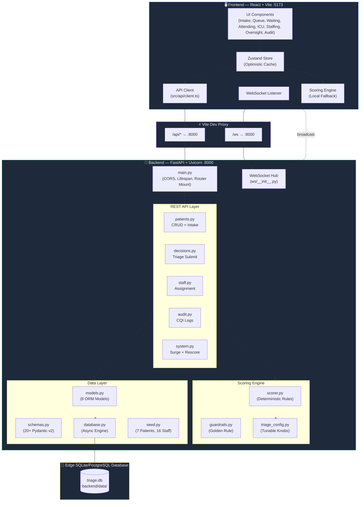
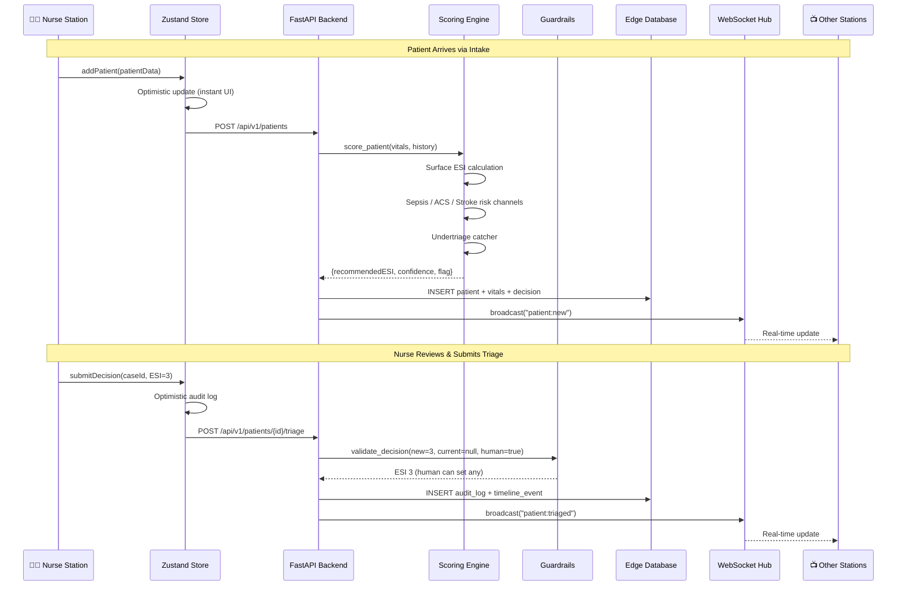
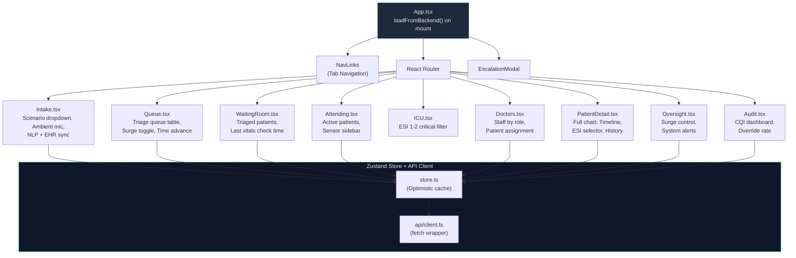
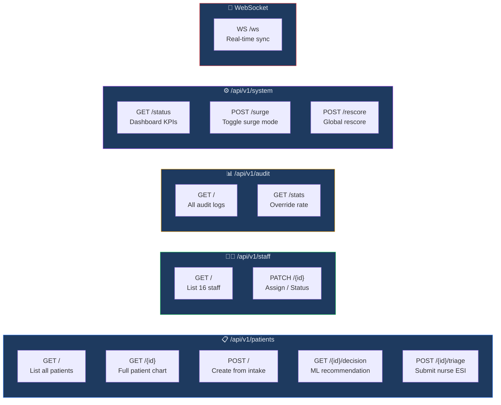
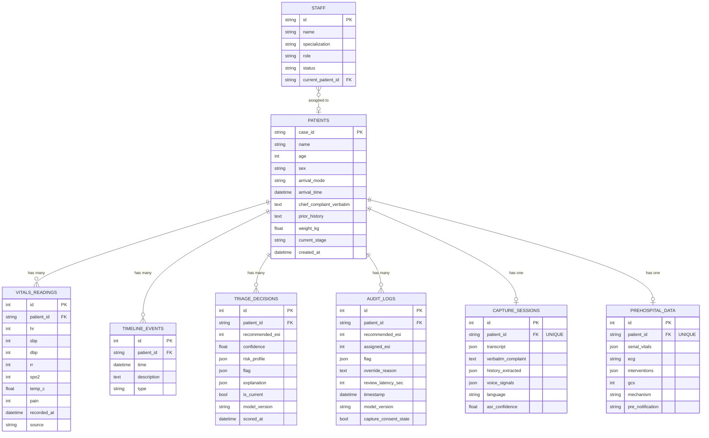

# PatientTriage.ai — Master Technical & Product Specification

**Project:** Accenture Innovation Challenge 2026 — Round 2, Track 2  
**Product Name:** PatientTriage.ai  
**Status:** MVP Integrated (React Frontend + FastAPI/SQLite Backend)  

---

## 1. Executive Summary & Vision

Emergency Departments (EDs) are the highest-stress bottleneck in modern healthcare. The traditional triage process relies on manual data entry, subjective rapid assessments, and discrete, point-in-time vital signs. This leads to nurse burnout, increased waiting room mortality, and the dangerous risk of **undertriage** (assigning a critically ill patient a lower priority than required).

**PatientTriage.ai** is a comprehensive, multimodal clinical decision-support ecosystem. It transforms the triage desk from a manual data-entry terminal into an intelligent ambient sensing environment. By fusing ambient voice capture, advanced computer vision, seamless EHR history synchronization, and deterministic clinical guardrails, the system acts as an invisible safety net for triage nurses. 

**The Core Tenet:** *The machine recommends, the nurse decides.* The system is hard-coded with a "Golden Rule": AI can escalate a patient's priority to ensure safety, but it cannot override a human nurse to lower it.

---

## 2. High-Level System Architecture

The ecosystem relies on a modern, decoupled architecture designed for absolute zero-latency on the client side, backed by robust asynchronous edge-servers.



---

## 3. Advanced Hardware Ecosystem: The "Invisible" Intake

To achieve true ambient data collection without adding to the nurse's workload, PatientTriage.ai proposes integrating specialized hardware not currently standard in hospital EDs. *(Note: Standard point-of-care vital capture like BP cuffs and pulse oximeters are assumed and excluded from this section).*

### 3.1 Ambient Audio Capture & Diarization
The chaotic acoustic environment of an ED requires specialized hardware to capture the patient interview accurately.
* **Ceiling-Mounted Beamforming Microphone Arrays:** (e.g., Shure MXA910 or specialized healthcare equivalents). These arrays create directional acoustic "lobes" targeted precisely at the nurse's chair and the patient's standing/sitting position.
* **Edge-AI Audio Processors:** Local DSP (Digital Signal Processing) units process the raw audio to filter out background noise (crying, PA announcements, alarms). 
* **Speaker Diarization:** The system differentiates between the Nurse, the Patient, and Accompanying Family Members, ensuring the NLP model maps the chief complaint to the correct speaker without cross-contamination.

### 3.2 Non-Contact Biometric Sensors (Computer Vision)
Before a nurse even touches a patient, the system begins gathering passive biometric data via intake-desk cameras.
* **Remote Photoplethysmography (rPPG):** High-definition RGB cameras analyze micro-color changes in the patient's facial skin to passively calculate Heart Rate (HR) and Respiratory Rate (RR) during the interview.
* **Infrared (IR) Thermography:** Thermal imaging cameras automatically detect core body temperature anomalies (fever mapping) instantly upon the patient stepping to the desk.
* **Kinematic Pose Estimation:** Cameras analyze gait and posture (e.g., clutching abdomen, limping) to provide an objective "pain behavior" score, augmenting the subjective 1-10 pain scale reported by the patient.

### 3.3 Prehospital IoT Integration (Ambulance Telemetry)
For ambulance arrivals, intake begins before the patient reaches the hospital doors.
* **Continuous ECG & Telemetry Bridging:** Direct API integration with ambulance monitors (e.g., ZOLL or Physio-Control) streams serial vitals directly into the queue.
* **Paramedic Body-Cam Audio:** Streaming audio from the paramedic's handoff is ingested by the NLP engine to pre-populate the patient chart before they roll through the doors.

---

## 4. Patient Pipeline Flow

```mermaid
flowchart LR
    subgraph INTAKE["📋 INTAKE"]
        A1["Ambulance / Walk-in Arrival"]
        A2["Ambient Mic Capture<br/>(NLP Transcript)"]
        A3["EHR Sync<br/>(Medical History)"]
        A4["Vitals Measurement"]
        A5["POST /api/v1/patients"]
    end

    subgraph QUEUE["1️⃣ QUEUE"]
        Q1["AI Scores Patient<br/>(scorer.py)"]
        Q2["Surface ESI 1-5"]
        Q3["Undertriage Check<br/>(Occult Risk Channels)"]
        Q4["Uncertainty Gate<br/>(Missing Vitals / ASR)"]
        Q5["Nurse Reviews Chart"]
        Q6["POST /patients/{id}/triage<br/>(Submit ESI)"]
    end

    subgraph WAITING["2️⃣ WAITING ROOM"]
        W1["Patient in Audit Log"]
        W2["Periodic Vitals Recheck"]
        W3["Deterioration Alerts"]
        W4["Wait Time Tracking"]
    end

    subgraph ATTENDING["3️⃣ ATTENDING"]
        A6["Doctor Assigned<br/>PATCH /staff/{id}"]
        A7["Bed Assignment"]
        A8["Active Treatment"]
        A9["Sensor Monitoring<br/>(Equipment, Beds)"]
    end

    subgraph ICU["🏥 ICU / CRIT"]
        I1["ESI 1-2 Filter"]
        I2["Critical Care Monitoring"]
        I3["Ventilator / IV Tracking"]
    end

    A1 --> A2 --> A3 --> A4 --> A5
    A5 -->|"stage: queue"| Q1
    Q1 --> Q2 --> Q3 --> Q4 --> Q5 --> Q6
    Q6 -->|"stage: waiting"| W1
    W1 --> W2 --> W3
    W3 -->|"Doctor assigned"| A6
    A6 -->|"stage: attending"| A7 --> A8 --> A9
    A8 -->|"ESI 1-2"| I1 --> I2 --> I3

    style INTAKE fill:#0f172a,stroke:#3b82f6,color:#e2e8f0
    style QUEUE fill:#0f172a,stroke:#f59e0b,color:#e2e8f0
    style WAITING fill:#0f172a,stroke:#a855f7,color:#e2e8f0
    style ATTENDING fill:#0f172a,stroke:#22c55e,color:#e2e8f0
    style ICU fill:#0f172a,stroke:#ef4444,color:#e2e8f0
```



---

## 5. Machine Learning Pipeline & Triage Engine

1. **ASR (Automatic Speech Recognition):** Edge-hosted Whisper models convert the beamforming mic audio into text.
2. **Clinical NLP (Entity Extraction):** Models (e.g., ClinicalBERT) extract symptoms, duration, and severity from the transcript.
3. **Scoring Engine (Hybrid Model):**
   * **Deterministic Rules Engine:** Hard-coded Emergency Severity Index (ESI) algorithms.
   * **Predictive Risk Model:** XGBoost models trained to identify "occult" risks (e.g., Sepsis, ACS, Stroke) based on subtle combinations of EHR history and vitals.

### The Real-Time Sync & Scoring Sequence



---

## 6. Frontend Component Architecture

The React frontend utilizes a centralized optimistic store pattern to ensure that the UI never blocks or freezes during high-stress ED scenarios.



---

## 7. API & Database Architecture

### 7.1 API Endpoint Map



### 7.2 Database Schema (Entity Relationship Diagram)



---

## 8. Clinical Guardrails & Ethical AI

The system is designed to augment human intelligence, never replace it. These rules are enforced at the backend API layer (`guardrails.py`), making them impossible to bypass via the UI.

1. **The Golden Rule:** `assigned_acuity <= recommended_acuity` (lower number = higher severity in ESI). The AI can escalate a patient's priority to ensure safety, but it cannot override a nurse's clinical judgment to lower a patient's priority.
2. **Bias Mitigation:** The scoring engine is stripped of demographic weighting (race, gender) that historically introduces bias into medical algorithms, relying strictly on physiological and historical clinical data.
3. **Uncertainty Gates:** If the ambient audio is garbled or vitals are missing, the AI output is dimmed and tagged with an "Uncertainty" flag, forcing manual nurse review.

---

## 9. Security, Compliance, & Deployment

* **HIPAA / SOC2 Compliance:** All audio processing and ML inference is designed to happen on **Edge Servers** within the hospital's secure intranet. No PHI (Protected Health Information) is sent to external cloud APIs for processing.
* **Data Persistence:** The SQLite/PostgreSQL databases are encrypted at rest.
* **Authentication:** Role-Based Access Control (RBAC) ensures only credentialed nurses can sign off on triage scores, and only ED Admins can toggle Surge Mode.

---

## 10. Repository File Structure

```
PatientTriage.ai/
├── triage-app/                          ← Frontend (Vite/React)
│   ├── src/
│   │   ├── api/
│   │   │   └── client.ts               ← API fetch wrapper
│   │   ├── components/                 ← All UI modules
│   │   ├── engine/                     ← Local fallback scorer
│   │   ├── config/                     ← Clinical thresholds
│   │   ├── data/                       ← Seed data fallback
│   │   ├── store.ts                    ← Zustand + API sync
│   │   ├── types.ts                    ← TypeScript interfaces
│   │   └── App.tsx                     ← Router + backend loader
│   └── vite.config.ts                  ← Proxy config (/api -> :8000)
│
└── backend/                             ← Backend (FastAPI/Python)
    ├── requirements.txt
    ├── data/triage.db                   ← SQLite database
    └── app/
        ├── main.py                      ← FastAPI entry point
        ├── config/
        │   └── triage_config.py         ← Python config mirror
        ├── engine/
        │   ├── scorer.py                ← Deterministic + ML scorer
        │   └── guardrails.py            ← Golden rule enforcement
        ├── models/                      ← 8 SQLAlchemy models
        ├── schemas/                     ← Pydantic schemas
        ├── db/                          ← Async SQLAlchemy & seeder
        ├── api/                         ← REST Endpoints
        └── ws/                          ← WebSocket Hub
```

---

## 11. Local Setup & Testing Instructions

To run the integrated MVP locally:

### Step 1: Start the Backend (FastAPI)
```bash
cd backend
# Install Python dependencies
pip3 install -r requirements.txt
# Start the Uvicorn server (port 8000)
uvicorn app.main:app --port 8000 --reload
```
*Note: The SQLite database (`triage.db`) will auto-generate and seed with demographic, staff, and simulated triage data on startup.*

### Step 2: Start the Frontend (React/Vite)
```bash
# In a new terminal tab
cd triage-app
# Install Node dependencies
npm install
# Start the Vite development server (port 5173)
npm run dev
```

### Step 3: Access the System
* **Application Interface:** Open `http://localhost:5173`. A status indicator in the top right will show a Green Dot confirming successful WebSocket and REST API connection to the backend.
* **API Documentation:** Open `http://localhost:8000/docs` to view the interactive Swagger/OpenAPI specifications.
