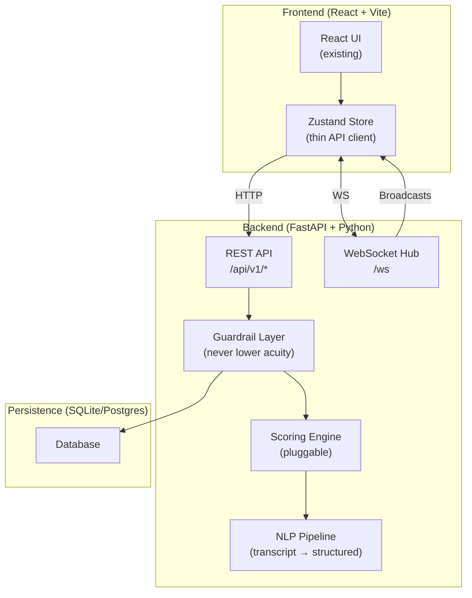
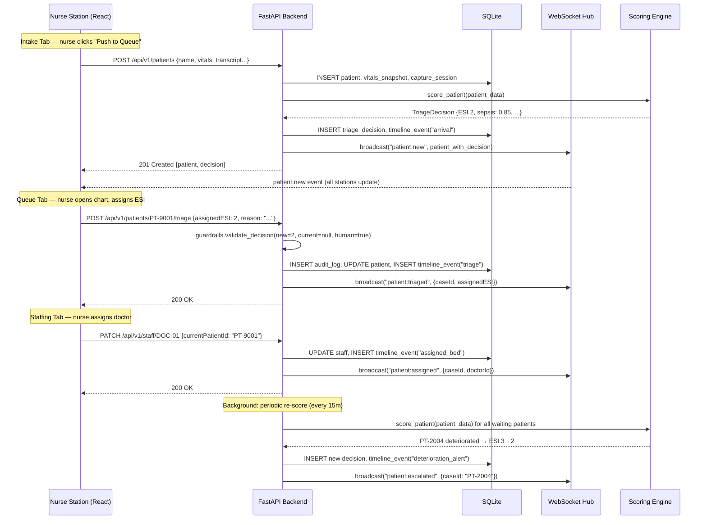
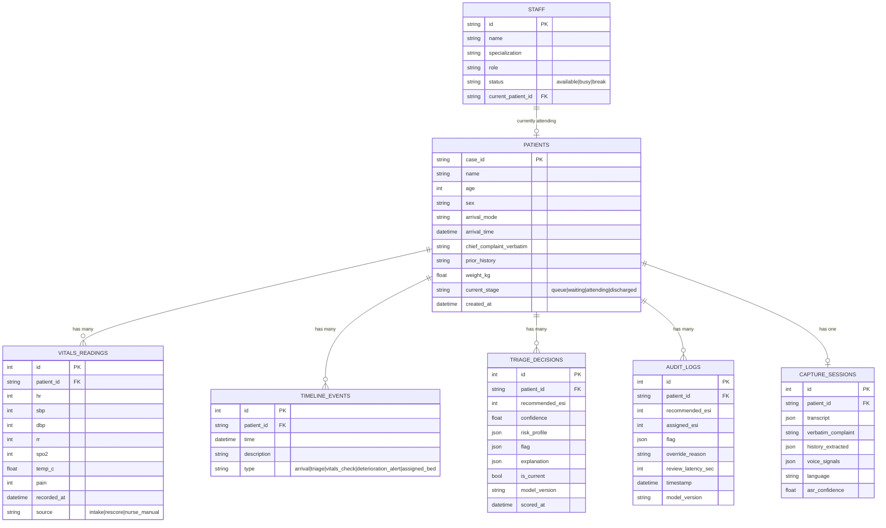

# PatientTriage.ai — Backend Architecture Plan

## Problem

The current prototype runs entirely in-browser: patient data lives in Zustand (in-memory), the scoring engine is a deterministic TypeScript function, and there is no persistence, no authentication, no real-time sync, and no actual ML inference. To move from prototype to production-grade system, we need a backend that:

1. Persists all patient encounters, triage decisions, audit logs, and staff assignments in a real database
2. Runs the triage scoring engine server-side (so the model can later be swapped for a real ML model without touching the frontend)
3. Provides real-time updates across multiple nurse stations via WebSockets
4. Enforces the core guardrail server-side: **never lower a human-assigned acuity**
5. Remains **100% locally deployable** — no cloud dependencies at runtime

> [!IMPORTANT]
> **Hard constraint from PRD:** This is decision-support software, not a clinical device. Every recommendation is advisory. No acuity a human has assigned is ever lowered by the system. This must be enforced at the API layer, not just the UI.

---

## Open Questions

> [!IMPORTANT]
> **Q1: Python or Node.js for the backend?**
> I recommend **Python (FastAPI)** because:
> - The ML/NLP pipeline (voice signal analysis, NLP extraction, risk scoring) will inevitably use Python libraries (scikit-learn, transformers, spaCy)
> - FastAPI has native WebSocket support, auto-generated OpenAPI docs, and async performance
> - The alternative is Node.js (Express/Fastify) which keeps the stack uniform with the frontend but creates friction when adding ML models
>
> **Do you agree with Python/FastAPI, or do you prefer Node.js?**

> [!IMPORTANT]
> **Q2: Database choice — SQLite or PostgreSQL?**
> For a locally-deployed prototype with no cloud:
> - **SQLite** — zero config, single file, perfect for demo. Can be upgraded later.
> - **PostgreSQL** — production-grade, better for concurrent multi-station access, but requires a running server process.
>
> I recommend **SQLite for the prototype** (via SQLAlchemy ORM, trivially swappable to Postgres later). Agree?

> [!IMPORTANT]
> **Q3: Do you want real ML model inference now, or keep the deterministic scorer?**
> Options:
> - **A)** Keep the current rule-based scorer (port it to Python) — simplest, demo-ready
> - **B)** Add a lightweight scikit-learn model trained on synthetic data — more impressive for the demo
> - **C)** Integrate a local LLM (e.g., Ollama + Llama/Mistral) for the NLP extraction from transcripts
>
> I recommend **A for now** (port the deterministic scorer), with the architecture designed so B and C are drop-in replacements.

---

## Proposed Architecture



---

## Proposed Changes

### Backend Service (`/backend`)

> [!NOTE]
> All backend code lives in a new `/backend` directory at the project root, alongside the existing `/triage-app` frontend.

---

#### [NEW] `/backend/pyproject.toml`
Project manifest. Dependencies:
- `fastapi` + `uvicorn` — API server
- `sqlalchemy` + `aiosqlite` — async ORM + SQLite driver
- `pydantic` — request/response validation (shared with FastAPI)
- `websockets` — real-time broadcast
- `python-jose` — JWT tokens (for future auth)
- `alembic` — database migrations

---

#### [NEW] `/backend/app/main.py`
FastAPI application entry point. Mounts:
- REST router at `/api/v1`
- WebSocket endpoint at `/ws`
- CORS middleware (allows `localhost:5173` in dev)
- Lifespan handler to seed database on first boot

---

#### [NEW] `/backend/app/models/`
SQLAlchemy ORM models mapping directly to the existing TypeScript interfaces:

| File | Maps to (frontend) | Table | Purpose |
|------|-------------------|-------|---------|
| `patient.py` | `PatientEncounter` | `patients` | Core patient record |
| `vitals.py` | `Vitals` | `vitals_readings` | One-to-many vitals snapshots per patient |
| `timeline.py` | `TimelineEvent` | `timeline_events` | Immutable event log per patient |
| `decision.py` | `TriageDecision` | `triage_decisions` | ML recommendation per scoring run |
| `audit.py` | `AuditRecord` | `audit_logs` | Human override log (CQI) |
| `staff.py` | `Doctor` | `staff` | Clinical staff registry |
| `capture_session.py` | `CaptureSession` | `capture_sessions` | Transcript, NLP extractions, voice signals |

**Key design decision:** Vitals are stored as **snapshots** (one row per measurement), not a single record. This enables the timeline feature and re-scoring over time. Each snapshot is linked to a `timeline_event`.

---

#### [NEW] `/backend/app/schemas/`
Pydantic schemas for request/response validation. These are auto-generated mirrors of the TypeScript types:

| File | Purpose |
|------|---------|
| `patient.py` | `PatientCreate`, `PatientResponse`, `PatientWithDecision` |
| `vitals.py` | `VitalsCreate`, `VitalsSnapshot` |
| `decision.py` | `TriageDecisionResponse`, `SubmitDecisionRequest` |
| `audit.py` | `AuditLogResponse` |
| `staff.py` | `StaffResponse`, `AssignDoctorRequest` |
| `intake.py` | `IntakePayload` (everything the frontend sends when "Push to Queue" is clicked) |

---

#### [NEW] `/backend/app/api/v1/`
REST API routes, organized by domain:

| File | Endpoints | Maps to (Zustand action) |
|------|-----------|--------------------------|
| `patients.py` | `GET /patients` — list all (with filters: queue/waiting/attending) | Initial state load |
| | `POST /patients` — create from intake | `addPatient()` |
| | `GET /patients/{id}` — full chart with timeline | PatientDetail page |
| | `POST /patients/{id}/vitals` — record new vitals snapshot | Re-score trigger |
| `decisions.py` | `POST /patients/{id}/triage` — submit nurse's ESI decision | `submitDecision()` |
| | `GET /patients/{id}/decision` — get current ML recommendation | Decision panel |
| `staff.py` | `GET /staff` — list all staff | Staffing tab |
| | `PATCH /staff/{id}` — update status, assign patient | `assignDoctor()` |
| `audit.py` | `GET /audit` — full audit log with override stats | Audit tab |
| `system.py` | `POST /system/surge` — toggle surge mode | `toggleSurgeMode()` |
| | `POST /system/rescore` — trigger global re-score | `reScoreAll()` |
| | `GET /system/status` — bed counts, queue depth, KPIs | Dashboard KPIs |

---

#### [NEW] `/backend/app/engine/scorer.py`
Direct Python port of the existing [`scoringEngine.ts`](file:///Users/ayanshshankar/Desktop/Accenture/Prototype_Accenture/triage-app/src/engine/scoringEngine.ts). This is a pure function:

```python
def score_patient(patient: PatientEncounter, is_surge: bool = False) -> TriageDecision:
    """Deterministic triage scorer. Drop-in replaceable with ML model."""
    ...
```

**Pluggable design:** The scorer is injected via dependency injection. To swap in a real ML model later:
```python
# config.py
SCORER = "app.engine.scorer:score_patient"        # rule-based (default)
# SCORER = "app.engine.ml_scorer:score_patient"    # scikit-learn model
# SCORER = "app.engine.llm_scorer:score_patient"   # local LLM
```

---

#### [NEW] `/backend/app/engine/guardrails.py`
Server-side enforcement of the core safety rule:

```python
def validate_decision(new_esi: int, current_esi: int | None, is_human: bool) -> int:
    """
    THE GOLDEN RULE: The system NEVER lowers a human-assigned acuity.
    Only a human can lower it. The system can only raise it (lower ESI number).
    """
    if current_esi is not None and not is_human:
        return min(new_esi, current_esi)  # Only raise, never lower
    return new_esi
```

---

#### [NEW] `/backend/app/ws/hub.py`
WebSocket connection manager for real-time multi-station sync:

```python
class ConnectionManager:
    async def broadcast(self, event: str, data: dict):
        """Push to all connected nurse stations"""
        ...
```

Events broadcast:
- `patient:new` — new patient added from intake
- `patient:triaged` — nurse signed off on ESI
- `patient:assigned` — doctor assigned, patient moves to Attending
- `patient:vitals_update` — new vitals recorded, re-score triggered
- `patient:escalated` — system detected deterioration
- `surge:toggled` — surge mode changed
- `staff:updated` — doctor status changed

---

#### [NEW] `/backend/app/services/`
Business logic layer (called by API routes, not directly by frontend):

| File | Purpose |
|------|---------|
| `intake_service.py` | Validates intake payload, creates patient + initial vitals + timeline event, triggers scorer, broadcasts `patient:new` |
| `triage_service.py` | Runs guardrail check, saves decision + audit log, broadcasts `patient:triaged` |
| `rescore_service.py` | Periodic or manual re-scoring of all waiting patients. Detects deterioration. Broadcasts escalations. |
| `staff_service.py` | Assignment logic. Validates doctor availability. Moves patient pipeline stage. |

---

#### [NEW] `/backend/app/config/triage_config.py`
Direct Python port of [`triageConfig.ts`](file:///Users/ayanshshankar/Desktop/Accenture/Prototype_Accenture/triage-app/src/config/triageConfig.ts) — all tunable knobs in one place.

---

#### [NEW] `/backend/app/db/`

| File | Purpose |
|------|---------|
| `database.py` | SQLAlchemy async engine + session factory |
| `seed.py` | Seeds the DB with the same data from `patients.ts` and `doctors.ts` on first boot |

---

### Frontend Changes (`/triage-app/src`)

#### [MODIFY] [`store.ts`](file:///Users/ayanshshankar/Desktop/Accenture/Prototype_Accenture/triage-app/src/store.ts)
The Zustand store transforms from "source of truth with business logic" to a **thin API client + cache**:

- Remove: `scorePatient()` calls, `seedPatients` import, all inline business logic
- Add: `fetch()` calls to backend REST API
- Add: WebSocket listener that updates local state on broadcast events
- Keep: Optimistic UI updates for responsiveness (confirmed by WebSocket)

#### [MODIFY] [`Intake.tsx`](file:///Users/ayanshshankar/Desktop/Accenture/Prototype_Accenture/triage-app/src/components/Intake.tsx)
- `handleSendToQueue()` now `POST /api/v1/patients` instead of `addPatient(demoCase)`

#### [MODIFY] [`PatientDetail.tsx`](file:///Users/ayanshshankar/Desktop/Accenture/Prototype_Accenture/triage-app/src/components/PatientDetail.tsx)
- `handleAssign()` now `POST /api/v1/patients/{id}/triage` instead of `submitDecision()`
- Timeline and vitals history are fetched from `GET /api/v1/patients/{id}`

#### [MODIFY] [`Doctors.tsx`](file:///Users/ayanshshankar/Desktop/Accenture/Prototype_Accenture/triage-app/src/components/Doctors.tsx)
- Assignment now `PATCH /api/v1/staff/{id}` instead of `assignDoctor()`

---

### Project Structure (Final)

```
Prototype_Accenture/
├── triage-app/                    # Frontend (React + Vite) — existing
│   ├── src/
│   │   ├── components/            # UI components (existing, minor mods)
│   │   ├── store.ts               # Zustand → thin API client
│   │   ├── types.ts               # Shared types (kept in sync)
│   │   └── api/                   # [NEW] API client helpers
│   │       ├── client.ts          # fetch wrapper + error handling
│   │       └── websocket.ts       # WS connection + event dispatcher
│   └── package.json
│
├── backend/                       # [NEW] Backend (Python + FastAPI)
│   ├── pyproject.toml
│   ├── app/
│   │   ├── main.py                # FastAPI app entry
│   │   ├── config/
│   │   │   └── triage_config.py   # Tunable knobs
│   │   ├── models/                # SQLAlchemy ORM models
│   │   │   ├── patient.py
│   │   │   ├── vitals.py
│   │   │   ├── timeline.py
│   │   │   ├── decision.py
│   │   │   ├── audit.py
│   │   │   ├── staff.py
│   │   │   └── capture_session.py
│   │   ├── schemas/               # Pydantic request/response
│   │   │   ├── patient.py
│   │   │   ├── decision.py
│   │   │   ├── audit.py
│   │   │   ├── staff.py
│   │   │   └── intake.py
│   │   ├── api/
│   │   │   └── v1/                # REST endpoints
│   │   │       ├── patients.py
│   │   │       ├── decisions.py
│   │   │       ├── staff.py
│   │   │       ├── audit.py
│   │   │       └── system.py
│   │   ├── engine/                # ML / Scoring
│   │   │   ├── scorer.py          # Rule-based (port of TS)
│   │   │   ├── guardrails.py      # Safety enforcement
│   │   │   └── nlp_pipeline.py    # Future: transcript → structured
│   │   ├── services/              # Business logic
│   │   │   ├── intake_service.py
│   │   │   ├── triage_service.py
│   │   │   ├── rescore_service.py
│   │   │   └── staff_service.py
│   │   ├── ws/
│   │   │   └── hub.py             # WebSocket broadcast manager
│   │   └── db/
│   │       ├── database.py        # Engine + session
│   │       └── seed.py            # Initial data seeder
│   ├── alembic/                   # DB migrations
│   ├── data/
│   │   └── triage.db              # SQLite file (auto-created)
│   └── tests/
│       ├── test_scorer.py
│       ├── test_guardrails.py
│       └── test_api.py
│
└── docker-compose.yml             # [NEW] One-command startup
```

---

## Data Flow: End-to-End Pipeline



---

## Database Schema (ERD)



---

## Verification Plan

### Automated Tests
```bash
# Run the full test suite
cd backend && python -m pytest tests/ -v

# Key tests:
# test_scorer.py       — verifies parity with the TypeScript scorer (same inputs → same outputs)
# test_guardrails.py   — verifies the "never lower acuity" rule under all edge cases
# test_api.py          — integration tests for every endpoint
```

### Manual Verification
1. Start backend: `cd backend && uvicorn app.main:app --reload`
2. Start frontend: `cd triage-app && npm run dev`
3. Walk through the full pipeline: Intake → Queue → PatientDetail → Waiting Room → Staffing → Attending
4. Verify WebSocket sync by opening two browser tabs simultaneously
5. Verify audit log populates correctly when overriding the AI's recommendation

---

## Startup (One Command)

```bash
# Option A: Manual
cd backend && uvicorn app.main:app --port 8000 --reload &
cd triage-app && npm run dev &

# Option B: Docker Compose (production)
docker-compose up
```

`docker-compose.yml` runs both services, mounts the SQLite volume, and proxies `/api` from Vite to the backend.
